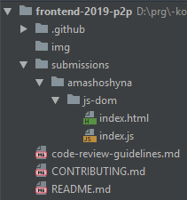

[![MIT Licensed][icon-mit]][license]
[![Kottans-Frontend][icon-kottans]][kottans-frontend]

# How to Contribute

Please, follow the guidelines below when submitting
a task code for review.

It is expected that a task codebase lives in its own dedicated repo,
and code copy is submitted to this repo for code review purposes.
Whenever changes are required these are done in a dedicated task
repo, demo gets updated, and then code is copied into this
repo fork to update the PR.

A student will benefit from having tasks code base in their own
dedicated repos as this forms student's portfolio.

<!-- START doctoc generated TOC please keep comment here to allow auto update -->
<!-- DON'T EDIT THIS SECTION, INSTEAD RE-RUN doctoc TO UPDATE -->
## Table of Contents

- [Preparations](#preparations)
- [Task code lifecycle](#task-code-lifecycle)
  - [Submit a task](#submit-a-task)
  - [Open a pull request](#open-a-pull-request)
  - [Update your code and PR](#update-your-code-and-pr)
  - [Merging the PR](#merging-the-pr)

<!-- END doctoc generated TOC please keep comment here to allow auto update -->
*TOC is generated with [DocToc](https://github.com/thlorenz/doctoc)*

## Preparations

- fork this repository
- clone your fork to your local machine:
  `git clone https://github.com/YOUR_USERNAME/frontend-2019-homeworks.git`
- add this repository as an upstream:
  `git remote add upstream https://github.com/kottans/frontend-2019-homeworks.git`
- in your local repository, add a folder with your github name under
  `submissions`

## Task code lifecycle

### Submit a task

In your local repository:

- `git checkout master`
- pull latest changes from upstream `master` branch:
  `git pull upstream master`
- **IMPORTANT!** create new branch, name it according to task performed
  (aka feature branch): `git checkout -b dom-api-task`.
  In this example feature branch is called `dom-api-task`
- under your name folder, add a folder with task name (e.g. `js-dom`)
  and put your code into the folder

  See example file structure you are expected to have below:

  

- commit your changes to newly created feature branch
- push feature branch to your remote repository:
  `git push --set-upstream origin dom-api-task`

### Open a pull request

- open a pull-request from your repository to this repository
  via GitHub web-interface
- give a PR name according to the task name,
  also change the PR message as appropriate
  (follow guidelines in the template)
- make sure the PR doesn't contain irrelevant commits
  from your own other PRs or from other contributors.
  This may happen if you branch off not from `master`
  as previous section requires. You may find this
  [Re-sync Fork With Upstream guide](https://gist.github.com/OleksiyRudenko/8b3ddb664308de0634b53c525e551d8b)
  helpful to fix the issue.

### Codereview
- you will **require** approvals* from **at least two peers**, so seek
for sufficient support. 
  - ask your peers for review in [FE Students chat](https://web.telegram.org/#/im?p=s1495296464_549300875144563897),
  post a link to your PR as well
  - if in some reason there are not reviwers from p2p course, you can ask your friends outside of the course 
- **you should provide a review** for this same task to **at least 2 PR's** of other students of p2p course
- after finishing previous steps ask mentors for review in [FE Questionarium chat](https://web.telegram.org/#/im?p=s1495296464_549300875144563897)
- once the code review phase successfully finished and you have approval from other students, post a message in [FE Students chat](https://web.telegram.org/#/im?p=s1495296464_549300875144563897): { Here must be the name of your task } — #p2p-pr-done and add the link to your PR. This step is important, as it helps mentors to track your progress!

*Code reviews that are only about code style/code formatting, variables and function naming, introducing semantic constants do not count.

Code reviewers are expected to follow
[code review guidelines](./code-review-guidelines.md).

### Update your code and PR

- Before making any changes:
  - read code reviewers' comments
  - answer questions if any
  - explain anything you are asked to explain
    as this gives an idea on your way of thinking and allows
    the code reviewer to render an appropriate help
  - ask questions if anything in comments or recommendations
    is not clear
- Implementing changes:
  - **DO NOT** update PR (files in the PR) using github web editor
    as this often merges `master` and also breaks conversation threads
  - **DO NOT** merge `master` into your feature branch
  - when implementing changes according to the changes request,
    consider cross-checking the entire code base for similar
    situation and fix as appropriately. Do not expect code reviewers
    to attract your attention to every single line of code that
    requires similar fix. Please, take care of your peers for reciprocity
  - implement changes in your **task dedicated repo** and **update demo**
    and commit
  - copy changed files to this repo fork feature branch and commit
  - push feature branch to your remote p2p repo to update your PR:
    `git push origin dom-api-task`
    (use actual feature branch name)
  - supplement commits with messages that give an idea of what's inside
    of the commit without looking into it.
    [How to Write a Git Commit Message](https://chris.beams.io/posts/git-commit/)
- Go to your PR on github and let code reviewers know your are done:
  - resolve conversations you believe you have elaborated on
  - make sure you answered questions and gave proper explanations where
    required (do not resolve those conversations until you have a feedback
    from a code reviewer)
  - if any conversations remain unresolved let reviewers
    know your're done explicitly (e.g. write a comment mentioning
    a code reviewer using `@`)

Q: Why just pushing a commit with changes is not sufficient?

A: It is not a rare case that changes are introduced in more
than one commit. So it is important to let reviewers know
they should not expect any further commits. **C** is for care.

[icon-mit]: https://img.shields.io/badge/license-MIT-blue.svg
[license]: https://github.com/OleksiyRudenko/a-tiny-JS-world/blob/master/LICENSE.md

[icon-kottans]: https://img.shields.io/badge/%3D(%5E.%5E)%3D-frontend-yellow.svg
[kottans-frontend]: https://github.com/kottans/frontend
