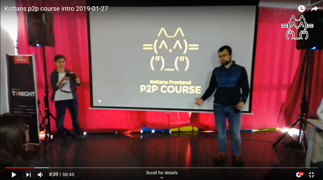

[![MIT Licensed][icon-mit]][license]
[![Kottans-Frontend][icon-kottans]][kottans-frontend]
&nbsp;&nbsp;&nbsp;&nbsp;&nbsp;&nbsp;
[![Telegram][icon-chat]][chat]

# Frontend 2019 p2p homework

This repo is supplementary to
[Kottans Frontend course](https://github.com/kottans/frontend)
and supports p2p (peer-to-peer) online learning mode.

Students are expected to complete course tasks one by one,
and employ this repo to submit practical tasks for review.

One of the points of p2p learning is that students conduct
code review for their peers so they learn not only to code
but also to read and understand code submitted by others
and deliver sensible and helpful feedback.

Students are expected to benefit from mutual support.
Offline phase course students are involved at early stages.
Kottans mentors are involved for final review and to merge
approved PRs to master.

[How to submit a task for review](./CONTRIBUTING.md).

[How to conduct code review](./code-review-guidelines.md).

---

Watch a video below for **Kottans p2p course intro**

(50m45s, narrated in Russian)

[icon-mit]: https://img.shields.io/badge/license-MIT-blue.svg
[license]: https://github.com/OleksiyRudenko/a-tiny-JS-world/blob/master/LICENSE.md
[icon-chat]: https://img.shields.io/badge/chat-on%20telegram-blue.svg

[icon-kottans]: https://img.shields.io/badge/%3D(%5E.%5E)%3D-frontend-yellow.svg
[kottans-frontend]: https://github.com/kottans/frontend
[chat]: https://t.me/joinchat/DmX0JAl-mh5W0jrWli8Ycw
